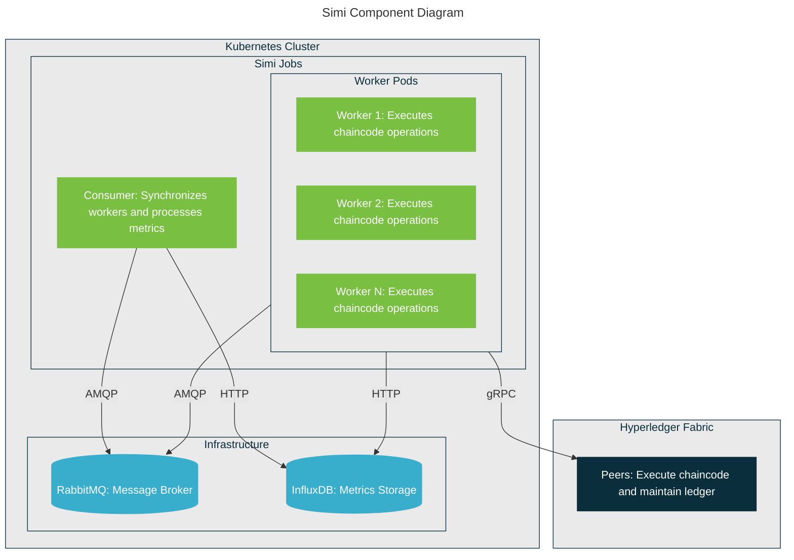

# Architecture of Simi
## Components

```mermaid
---
title: Simi Component Diagram
---
flowchart TB
    subgraph k8s[Kubernetes Cluster]
        subgraph simi[Simi Jobs]
            subgraph workers[Worker Pods]
                worker1[Worker 1: Executes chaincode operations]
                worker2[Worker 2: Executes chaincode operations]
                worker3[Worker N: Executes chaincode operations]
            end
            consumer[Consumer: Synchronizes workers and processes metrics]
        end

        subgraph infra[Infrastructure]
            rmq[(RabbitMQ: Message Broker)]
            influx[(InfluxDB: Metrics Storage)]
        end
    end

    subgraph hlf[Hyperledger Fabric]
        peer[Peers: Execute chaincode and maintain ledger]
    end

    %% Worker Pod connections
    workers -->|AMQP| rmq
    workers -->|HTTP| influx
    workers -->|gRPC| peer
    
    %% Consumer connections
    consumer -->|AMQP| rmq
    consumer -->|HTTP| influx

    %% Styling using Corsha brand colors
    classDef primary fill:#0a2e3b,stroke:#0a2e3b,color:#fff
    classDef accent fill:#78bf42,stroke:#78bf42,color:#fff
    classDef container fill:#eaeaea,stroke:#0a2e3b,color:#0a2e3b
    classDef database fill:#38aecc,stroke:#38aecc,color:#fff

    %% Apply styles
    class rmq,influx database
    class k8s,simi,infra,hlf,workers container
    class peer primary
    class worker1,worker2,worker3,consumer accent
```
