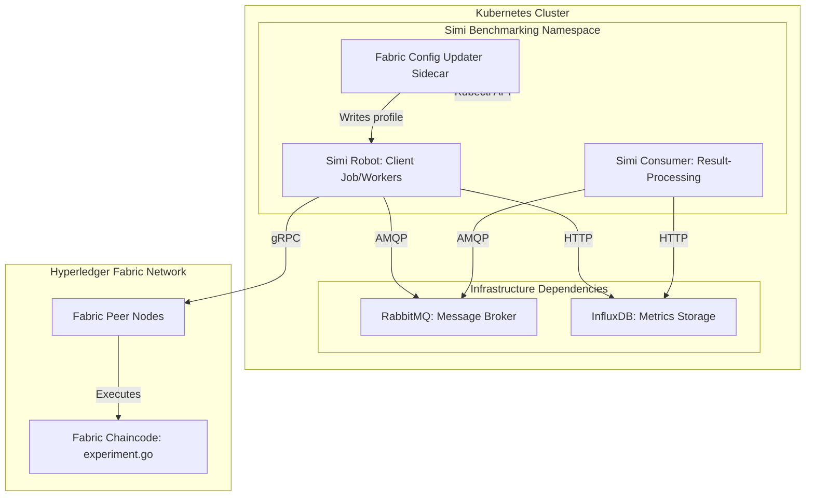

# Simi

Simi is a tool that can be used to rapidly populate a [Hyperledger Fabric](https://www.lfdecentralizedtrust.org/projects/fabric) DLN ledger with a large amount of data. It does so by running a Kubernetes job that deploys a number of Simi worker pods who each run a chaincode operation a number of times at a time interval.

Simi tracks duration each chaincode operation takes to complete and records it as a data point in InfluxDB. Upon completion of the Simi job, it will output its results to a directory in `./out/`.

---

## 1. Architecture Overview & Components

Simi is a high-performance benchmarking suite designed to evaluate and load-test Hyperledger Fabric Distributed Ledger Networks (DLNs). The architecture comprises three core container images interacting with coordinated infrastructure inside a Kubernetes cluster:



### Core Container Images

1. **`simi-robot` ([bin](./bin/))**
   The benchmark client, deployed as a Kubernetes Job. It scales horizontally via worker pods (completions/parallelism) to perform concurrent transaction runs. Each worker executes target chaincode operations at defined intervals, measures latencies, and publishes real-time telemetry.

2. **`simi-consumer` ([benchmark](./benchmark/))**
   The result-processing service. It acts as the coordinator and synchronization manager for the benchmarking run. By subscribing to coordination events on the broker, it tracks worker progress, aggregates benchmark outcomes, and formats metrics.

3. **`fabric-chaincode` ([fabric-chaincode](./fabric-chaincode/))**
   The Hyperledger Fabric external chaincode package. It implements the Go-based chaincode logic executed by Peer nodes under test, handling the transaction lifecycle and reporting low-level performance characteristics.

### Shared Infrastructure & Sidecars

* **RabbitMQ (Message Broker):** The message backbone used to synchronize the startup, progress, and shutdown sequence of all `simi-robot` worker pods.
* **InfluxDB (Metrics Storage):** The centralized telemetry database where transaction execution duration, success rates, and times are persisted for real-time visualization and historical analysis.
* **Fabric Config Updater (`fabric-config-updater`):** A sidecar container running alongside the main `simi-robot` container. It dynamically polls and decodes the current DLN Fabric SDK connection profile from a Kubernetes Secret (`dln-config`) and outputs it as `fabric-config.yaml`. This ensures that workers remain up-to-date with network endpoint definitions without requiring hardcoded connection configurations. Once the main benchmark execution completes, it writes a termination marker (`/fabric-config/done`) to gracefully stop the sidecar.

---

## 2. Local Development & Customization

### Custom Chaincode Go Code

By default, Simi is configured to perform a dynamic peer-scaling read/write benchmark workflow. This workflow executes read and write operations against the Hyperledger Fabric ledger to measure performance, throughput, and latency under dynamic scaling conditions. Specifically, the write benchmark writes data blocks of a configurable size to the ledger (invoking the `experimentWrite` chaincode function), while the read benchmark queries those values (invoking the `experimentRead` chaincode function).

To run Simi with a custom chaincode operation, you will need to implement an instance of the `WorkerConfig` type defined here: [./config/config.go](./config/config.go) for your chaincode operation. The `WorkerConfig` type is used by Simi to operate a Simi worker.

Once your instance has been implemented, build your changes into a Simi image with the following commands:

```bash
make simi
make simi-image
```

### Local Development Setup (Zero-Registry Workflow)

For local development and testing, you can compile and build images locally and load them directly into your Kubernetes cluster without needing to configure or push to an external container registry.

#### Step 1: Compile Code and Build Images
To compile the Go binaries and build all three container images locally, use the provided Makefile target:

```bash
make build-images
```

This compiles the required Go binaries (`simi`, `bench-consumer`, and the Fabric chaincode server) and generates the following local Docker images:
* `corsha/simi-robot:latest`
* `corsha/simi-consumer:latest`
* `corsha/fabric-chaincode:latest`

#### Step 2: Load Images into Local Kubernetes Clusters

##### Kind (Kubernetes in Docker)
To load your newly built images directly into a running `kind` cluster, execute:

```bash
kind load docker-image corsha/simi-robot:latest
kind load docker-image corsha/simi-consumer:latest
kind load docker-image corsha/fabric-chaincode:latest
```

##### Minikube
To load the local builds into a `minikube` cluster, execute:

```bash
minikube image load corsha/simi-robot:latest
minikube image load corsha/simi-consumer:latest
minikube image load corsha/fabric-chaincode:latest
```

*Note:* Alternatively, you can point your terminal session directly to the Minikube in-cluster Docker daemon before building:

```bash
eval $(minikube docker-env)
make build-images
```

---

## 3. Remote / Team Setup (Registry-Based Workflow)

When deploying to remote environments (such as staging or production namespaces) or collaborating with a development team, you must tag and publish the container images to an accessible container registry (e.g., GitHub Container Registry (GHCR), AWS ECR, or Docker Hub).

The project's Makefile supports parameterized overrides via the `REGISTRY` and `TAG` environment variables:

```bash
REGISTRY=ghcr.io/your-github-username TAG=v1.0.0 make publish-images
```

### Parameterization Mechanics

* **`REGISTRY`:** Prepends your container registry hostname and namespace (e.g., `ghcr.io/your-github-username`). If left empty, images default to local `corsha/` tagging.
* **`TAG`:** Overrides the image tag (defaults to `latest`).
* **`IMAGE_PREFIX`:** The Makefile computes this prefix dynamically in the format `$(REGISTRY)/corsha/<image-name>:$(TAG)`.

Running the command above will build and push the following tags:
* `ghcr.io/your-github-username/corsha/simi-robot:v1.0.0`
* `ghcr.io/your-github-username/corsha/simi-consumer:v1.0.0`
* `ghcr.io/your-github-username/corsha/fabric-chaincode:v1.0.0`

---

## Setting Up the Hyperledger Fabric (HLF) Environment

This section guides you through configuring the underlying Hyperledger Fabric (HLF) infrastructure required to run the Simi benchmark. The setup process consists of installing the HLF Operator via Helm, setting up Krew to install the `hlf` kubectl plugin, and bootstrapping the local Distributed Ledger Network (DLN).

### 1. Installing the HLF Operator via Helm

The HLF Operator is used to manage Hyperledger Fabric components inside your Kubernetes cluster. Add the official Helm repository and install the operator by executing:

```bash
helm repo add kf https://kf-software.github.io/hlf-helm-charts
helm repo update
helm install hlf-operator kf/hlf-operator --namespace default
```

### 2. Installing the `kubectl` HLF Plugin via Krew

`krew` is the standard plugin manager for Kubernetes SIGs. To install Krew, run the following script (extracted from `simi-osu/bin/setup.sh`):

```bash
# Install Krew
(
  set -x; cd "$(mktemp -d)" &&
  OS="$(uname | tr '[:upper:]' '[:lower:]')" &&
  ARCH="$(uname -m | sed -e 's/x86_64/amd64/' -e 's/\(arm\)\(64\)\?.*/\1\2/' -e 's/aarch64$/arm64/')" &&
  KREW="krew-${OS}_${ARCH}" &&
  curl -fsSLO "https://github.com/kubernetes-sigs/krew/releases/latest/download/${KREW}.tar.gz" &&
  tar zxvf "${KREW}.tar.gz" &&
  ./"${KREW}" install krew
)
export PATH="${KREW_ROOT:-$HOME/.krew}/bin:$PATH"
```

Once `krew` is set up, install the HLF plugin:

```bash
kubectl krew install hlf
```

### 3. Bootstrapping the Local Test Distributed Ledger Network (DLN)

Once your development cluster environment has the required operator and plugins, bootstrap the local test network by running our newly ported creation script:

```bash
cd autoscaling/files/
./create-dln.sh
```

This script leverages the `hlf` plugin and GKE cluster permissions to instantiate the Peer Orgs, CAs, Orderer, Demo-Channel, and dynamic peer-scaling contract, preparing a complete backend environment for Simi to benchmark.

---

## 4. Deploying Simi

> **_NOTE:_**  The Simi project does not publish images or Helm charts. You must build and publish your own.

### Script-Based Launch (Quickstart)

Simi can be deployed by running the [./benchmark/launch.sh](./benchmark/launch.sh) script. The script will prompt the user for the target namespace, the number of workers, the number of chaincode operations per worker, and the period between operation. To bypass the script's prompting, set the following env vars:

```bash
export TARGET_NS=simi-test
export SIMI_OPERATION_PERIOD=1s
export SIMI_NUM_WORKERS=500
export SIMI_OPERATIONS_PER_STREAM=100
export SIMI_OPERATION_TYPE=write
```

This example will setup 500 Simi workers and perform 100 write/read benchmark operations 1s apart on each of them.

When the benchmark finishes, it will output its results to a directory in `./out/`.

### Helm Chart Custom Configuration

The Helm chart is configured to expect custom configuration for your `OperationConfig` in the `.Values.operationConfig` object and will template that object into the Simi job's mounted configuration file, `simi.yaml`, when deploying.

In order to run against your DLN, replace the contents of [./k8s/helm/simi/fabric-config.yaml](./k8s/helm/simi/fabric-config.yaml) with the fabric-sdk config.yaml file for your DLN. Then either package the chart or set the `SIMI_HELM_CHART` environment variable to point to your local Chart directory.

For more information on the Simi Helm chart, see the Helm chart [README](./k8s/helm/simi/README.md).

### Helm Chart Deployment (Benchmarking Suite)

The modernized Helm chart is located under `k8s/helm/simi`. This chart configures and deploys the benchmarking client, consumer jobs, dynamic sidecar config updaters, and deploys RabbitMQ and InfluxDB as sub-charts.

To deploy the suite with custom image repositories, tag overrides, and helper/broker image locations, use the following `helm install` configuration:

```bash
helm install simi k8s/helm/simi \
  --set image.repository=ghcr.io/your-github-username/corsha/simi-robot \
  --set image.tag=v1.0.0 \
  --set consumer.image.repository=ghcr.io/your-github-username/corsha/simi-consumer \
  --set consumer.image.tag=v1.0.0 \
  --set kubectlImage=docker.io/bitnami/kubectl:1.30 \
  --set rabbitmq.image.registry=docker.io \
  --set rabbitmq.image.repository=bitnami/rabbitmq \
  --set rabbitmq.image.tag=4.1.3
```

#### Key Parameter Mappings

* `image.repository` and `image.tag`: Locates and tags the main Simi benchmark robot container.
* `consumer.image.repository` and `consumer.image.tag`: Locates the result-processing consumer container image. Note that depending on the chart template values structure, the consumer uses the common benchmark image tag (`image.tag`) for consistency.
* `kubectlImage`: Specifies the `bitnami/kubectl` container used by the `fabric-config-updater` sidecar to fetch and map Secret configurations.
* `rabbitmq.*`: Selects the repository, registry, and tag for the RabbitMQ message broker.

### Autoscaling Deployment

The `autoscaling` Helm chart located in the `autoscaling/` directory manages peer-scaling infrastructure for the Hyperledger Fabric network. This component acts as an automated network operator, dynamically spinning Fabric peer nodes up or down in response to metric thresholds.

#### How Autoscaling Operates

1. **KEDA Integration:** The chart configures KEDA `ScaledJobs` that monitor cluster metrics (e.g., CPU utilization rate across peer containers in the target namespace via Prometheus).
2. **Scaling Jobs:** When load thresholds are breached, KEDA triggers jobs executing shell scripts (e.g., `files/peer-scale-up.sh` and `files/peer-scale-down.sh`).
3. **Dynamic Chaincode Registration:** To allow new peer replicas to join the DLN ledger and start executing transactions immediately, the scaling jobs dynamically register and start the external chaincode on new peers using the specified `CHAINCODE_IMAGE` environment variable.

#### Deploying the Autoscaling Chart

Because newly scaled peers require the latest chaincode image to participate, you must provide your compiled `fabric-chaincode` image path to the autoscaling Helm chart.

Deploy the chart using the following command to override the `CHAINCODE_IMAGE` variable:

```bash
helm install simi-autoscaling autoscaling/ \
  --set CHAINCODE_IMAGE=ghcr.io/your-github-username/corsha/fabric-chaincode:v1.0.0
```

*Note on Values Structure:* Within the `autoscaling/values.yaml` chart structure, parameters are grouped under the `environment` block to map directly as environment variables into the scaling containers. While `--set CHAINCODE_IMAGE=...` overrides the variable at the chart's top level, the standard nested override can also be specified explicitly as:

```bash
--set environment.CHAINCODE_IMAGE=ghcr.io/your-github-username/corsha/fabric-chaincode:v1.0.0
```
